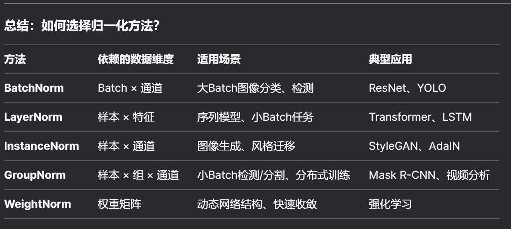

# * 创新点：
## * 同时训练多个生成模型：
多个模型竞争向discriminator学习的机会
维护一个模型列表，按照各自的对比损失从小到大排列，每个batch按顺序训练
模型通过比较自身对比损失和pre_loss，判断利用GAN的几率
如果自身损失较大，有限使用对比损失优化，反之则使用discriminator，尝试生成新的信息
第一个模型是生成信息的主力，剩下的用来维持基本表现
每个epoch结束后重新排序
## * 分段判断是否使用GAN训练：
大致可分为2段，模型损失大于Starting_GAN_loss时，大概率使用对比损失，小概率使用GAN;模型损失小于Starting_GAN_Loss时，第一个模型大概率使用GAN，后面的模型的对比损失大于当前最小对比损失时，大概率使用对比损失
# * 优化点
## * 引入模型互相学习机制？
在模型效果已经不错的前提下，向数据集里添加一些更高分辨率的图片，通过大量生成（大概率向discriminator学习） 少量对比（和待超分图片自身做对比，维持相似度） 以强带弱（弱表现模型向强表现模型学习） 地学习，或许能在维持基本相似度的前提下，由模型生成一些原图没有的细节
### * 意义？
在新数据集上优化原有模型？
若是纯粹的生成模型，互相学习或许可以帮助提高学习稳定性

BatchNorm 不适用分布式训练？